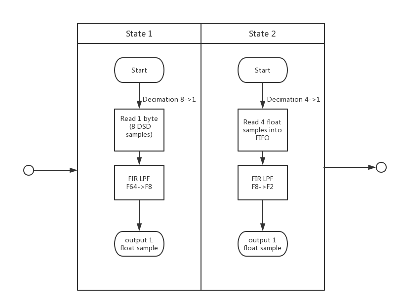

# DSD2PCM

This is a library convert dsd file to pcm, wav file,which reference for https://code.google.com/archive/p/dsd2pcm . I have do some improvement. The original dsd2pcm version located at the `./dsd2pcm/` directory for reference.

## what I do?

1. Repackage the dsd2pcm algorithm, remove the noise shape processing.
2. Replace the filter coefficients and order with a new version in order to export 88.2kHz signal. You can switch on thought the macro  `#define JAVA_VERSION`. 
   1. half filter taps: 48 -> 64
   2. fifo size: 16 -> 16*2
   3. add 64th fir filter coefficients

The deference of the dsd2pcm algorithm processing between the original version (state1) and the java version (state1+state2)  can be found as below.

In fact I tried to use halfband structure FIR filter to optimized the state2, but it is not so good. Maybe polyphase structure is better in this case, convert 352kHz to 88.2kHz.

For more details, you can check the VS2017 project, and for learning, you can read DSD2PCM 算法评估.pdf.